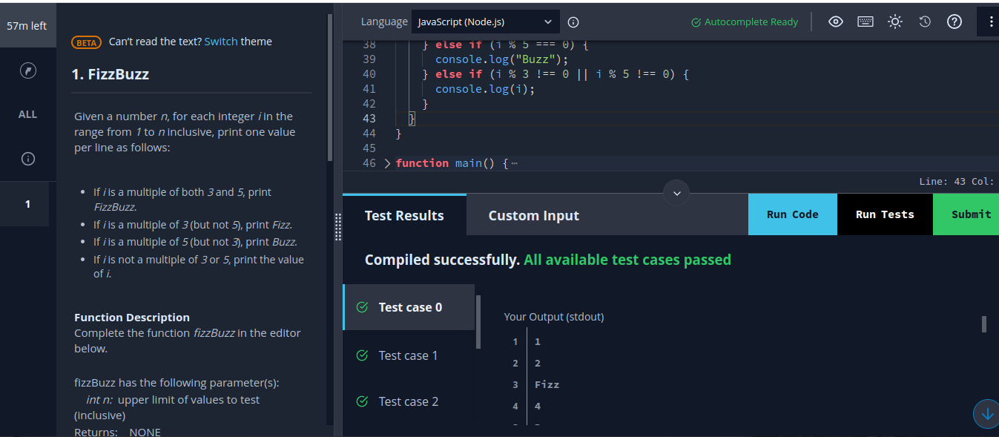

# Find the Median
The median of a list of numbers is essentially its middle element after sorting. The same number of
elements occur after it as before. Given a list of numbers with an odd number of elements, find the median?
## Preview
